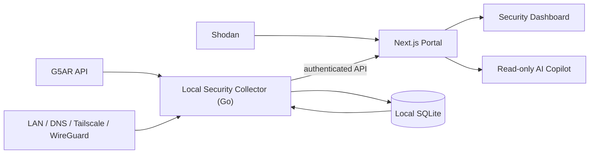
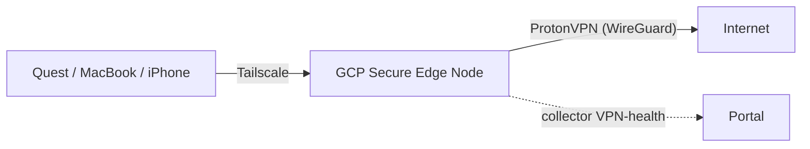

# Metameros Network — Security Operations Foundation Design

Status: Draft for review (no code until approved)
Date: 2026-06-27
Supersedes/extends: [docs/security-monitoring-roadmap.md](../../security-monitoring-roadmap.md)

## Goal

Evolve Metameros Network from a gateway admin UI into a **local-first network
security operations console**. This iteration delivers the trustworthy data
backbone — a privileged **local collector**, a unified **asset/finding model**,
**deterministic detection**, and a **read-only AI Copilot** — and, on a parallel
device-ops track, brings the **Meta Quest onto Tailscale** and stands up a
**self-hosted WireGuard** VPN whose health the platform monitors.

This is "Release 1" of the three-release plan (foundation → workspace control →
automation). Workspace control (remote desktop, deep Quest integration) and
automated remediation are explicitly **out of scope** here, but their asset
records are prepared.

## Non-negotiable invariants

These carry over from the repo's safe-by-default posture and are not optional:

1. **Privilege separation.** The collector is the only component that scans or
   probes. The Next.js portal stays unprivileged — it never runs `nmap`, never
   opens raw sockets, and reaches collector data only through an authenticated
   collector API.
2. **Off by default.** Scanning, DNS monitoring, VPN monitoring, and the AI
   Copilot are each independent feature flags, all disabled by default — same
   discipline as the existing Shodan phases (`config-server.ts`).
3. **Bounded scanning.** The collector only targets explicitly configured private
   subnets / known assets. No arbitrary or internet targets. Rate- and
   concurrency-limited. Reuses `router-host` validators to reject public IPs.
4. **AI is read-only.** The Copilot has no shell, no scan trigger, no remediation,
   no autonomous action. It reads sanitized findings/evidence and explains them.
   It may *recommend* actions; humans execute them.
5. **Local-first data.** The service-inventory history lives in collector-owned
   local SQLite. Nothing leaves the device without explicit opt-in, with the same
   redaction discipline as the diagnostics export.
6. **No secrets in git.** WireGuard private keys, Tailscale auth keys, and any API
   keys live in `.env.local` / mounted secrets, never committed. Generated client
   configs are treated as secrets.
7. **Auditability.** Every scan run, config generation, and write action is
   recorded via the audit logger.

## Architecture

- **Collector** — separate Go service/container. Runs controlled `nmap`, ARP/mDNS
  discovery, DNS posture checks, and VPN-health probes (Tailscale + WireGuard).
  Owns the SQLite store. Exposes a small authenticated HTTP API on the internal
  Docker network only (not published to host/tailnet).
- **Portal** — remains the command center: authentication, presentation, Shodan
  integration (stays portal-side — already built), user approvals, and the
  Copilot. Talks to the collector over the internal network with a shared token
  (or mTLS — see Open Questions).
- **SQLite** — collector-owned history with retention + redaction. Portal never
  opens the DB file directly; it goes through the collector API.

### Why a separate collector (vs. monolith / external SIEM)

Per Codex's analysis and the roadmap: a monolith would hand the public-facing web
process raw scanning privileges; an external SIEM (Wazuh/Elastic) is overkill for
a home lab. A small privileged collector is the right middle.

## Data model (the core)

The whole platform converges on the service-inventory model already sketched in
the roadmap. Tables (SQLite):

- **assets** — device identity: MAC, hostname, vendor (OUI), interfaces, first/last
  seen, trust state (trusted/unknown/blocked), notes. The Quest is an asset.
- **services** — observed listener: asset_id, interface, port, protocol, service
  name, detected product/version, scope (loopback/LAN/VPN/internet).
- **observations** — time-series rows linking a scan run to assets/services
  (append-only; powers drift detection).
- **findings** — derived, deduplicated: type, severity, asset/service refs,
  evidence (which observation(s)), state (open/acknowledged/resolved),
  recommendation text.
- **baselines** — the "expected" snapshot a finding is diffed against
  (per-asset/service expected scope + risk), seeded from the roadmap's port
  taxonomy.
- **acknowledgements** — who/when/why a finding was accepted; suppresses repeat
  alerts.
- **scan_runs** — metadata per run: trigger, target scope, duration, counts.

## Detection (deterministic first; AI never invents findings)

Rules run in the collector after each scan; findings are diffs against baseline:

- **New device** — MAC/ARP not in trusted inventory.
- **New listener** — service on a port not previously observed for that asset.
- **Scope escalation** — a service that was LAN-only now reachable on VPN/internet.
- **DNS drift** — A/AAAA/MX/TXT/SPF/DKIM/DMARC change for owned domains.
- **VPN failure** — Tailscale peer offline / WireGuard handshake stale past
  threshold.
- **Shodan exposure change** — public-IP exposure diff over time (extends the
  shipped Shodan feature).
- **High-signal ports** — e.g. **ADB 5555 on the Quest**, SSH/RDP/VNC exposed
  beyond expected scope (seeded from the roadmap taxonomy).

The AI Copilot explains and prioritizes these; it does not author or execute them.

## AI Copilot (read-only)

- Backed by Claude (Anthropic API). Default model: a current Claude model; configurable.
- **Tools are read-only** over sanitized findings + evidence: `list_findings`,
  `get_finding`, `get_asset`, `get_baseline`, `recommend_next_actions`. No tool
  can scan, write, or shell out.
- **Input redaction**: MACs/IPs/hostnames passed to the model are redacted/tokenized
  per the diagnostics-export discipline; raw identifiers never leave the device
  unless the user opts in.
- **Grounding**: every Copilot statement links back to a finding/observation id so
  claims are evidence-backed, not invented.
- Flag: `ENABLE_AI_COPILOT=false` by default; requires `ANTHROPIC_API_KEY` server-side.

## Parallel device-ops track: Quest on Tailscale + self-hosted WireGuard

This runs alongside the foundation and feeds the asset model.

### A. Quest → Tailscale (sideload official APK)

Quest is ADB-ready (Developer Mode + ADB confirmed). Steps:

1. Obtain the **official Tailscale Android APK** (from Tailscale's published
   releases / pkgs.tailscale.com). Verify checksum/signature before install.
2. `adb install` the APK to the Quest; sign in to the tailnet; verify the Quest
   appears as a tailnet node.
3. **Harden**: ADB-over-Wi-Fi (port 5555) should be **off when not actively
   developing** — the collector flags it as High when seen. Document the
   enable/disable procedure.
4. Register the Quest in the asset inventory (trusted) and as a VPN-health target.

This is device-ops, not portal code — but the procedure and asset record are
captured here and the collector monitors the result.

### B. VPN egress & the Secure Edge Node (GCP)

You already run Tailscale (WireGuard mesh) for private *access*. This iteration
adds a **GCP "Secure Edge Node"** — a small Ubuntu VM you own — that provides
**egress** (your devices' internet traffic exits through ProtonVPN) and a
**self-hosted WireGuard** server for non-Tailscale devices. ProtonVPN's
open-source WireGuard configs are the "your own VPN settings" you apply on the
node (Proton's servers can't be self-hosted, but their configs can be used here).

**Traffic model:**

**Secure Edge Node v1 (minimal, this iteration):**

- **VM**: Ubuntu 24.04 `e2-micro` (free-tier-eligible region), hardened.
- **Tailscale**: joined to the tailnet as a **subnet router + exit node**;
  admin/SSH reachable **only over Tailscale** — no public SSH, GCP firewall denies
  public inbound except what Tailscale needs (none, since Tailscale is outbound).
- **ProtonVPN egress**: the node's outbound internet routed through ProtonVPN via
  its WireGuard config (kill-switch posture so egress fails closed).
- **WireGuard server**: for devices not on Tailscale; reachable over Tailscale (no
  public UDP/51820). Config generator: private keys generated on-device where
  possible; server stores only public keys; generated configs are secrets.
- **Collector VPN-health**: probes Tailscale peer state + WireGuard handshakes +
  ProtonVPN tunnel liveness; failures/staleness become findings.

**Hardening invariants for the edge node** (it's internet-facing — treat as part
of the attack surface, monitored by this very platform):

- No public inbound ports; all admin via Tailscale.
- Egress fails closed if ProtonVPN drops (no leak to the raw GCP IP).
- Automatic security updates; minimal package set.
- The node is itself an **asset** in the inventory and a Shodan-exposure target.

**Explicitly deferred** (recorded as future asset/service records, not built now):
Caddy/Traefik, CrowdSec, Watchtower, Prometheus/Grafana, Portainer, Authentik,
Headscale, MQTT, and any app/API hosting. Adding nine services to a public VM on
day one is the shallow-integration / attack-surface trap this plan avoids.

## Deployment / Docker changes

- Add the **collector** service to the compose files (LAN + Tailscale variants).
  Internal network only; not published. Gets its own volume for the SQLite store.
- Collector needs elevated network capability for scanning (`cap_add`/host network
  on Linux); document the macOS/Docker-Desktop limitation (no host network) and
  the workaround.
- Portal gains collector API base URL + auth token via `.env.local`.
- New feature flags in `config-server.ts`:
  `ENABLE_LAN_DISCOVERY`, `ENABLE_DNS_MONITORING`, `ENABLE_VPN_MONITORING`,
  `ENABLE_AI_COPILOT` — all default `false`.

## Recommended additional updates (my suggestions)

- **Harden audit logging**: today `audit-logger` appends unbounded to `audit.log`
  in cwd. Add rotation/size cap and a configurable path; keep it for collector
  actions too.
- **Portal↔collector auth**: shared bearer token minimum; prefer mTLS on the
  internal network.
- **Scan-target allowlist** reuses `router-host` validators so a misconfig can
  never point a scan at a public IP.
- **WireGuard key hygiene**: server stores only public keys; private keys never
  transit the portal in logs; configs delivered once and not persisted server-side.
- **Tailscale ACLs / tagged auth keys** for the Quest and collector nodes.
- **Rename the local working copy** to `metameros-network` and delete the stale
  duplicate clone at `/Users/michaelerwin/Documents/GitHub/metameros-network`
  (housekeeping; unrelated to features).

## Acceptance criteria (Release 1)

- Collector runs as a separate service; portal has zero scanning privileges.
- A LAN discovery scan populates assets/services/observations; a baseline exists;
  re-running surfaces a "new listener"/"new device" finding.
- Findings have severity, evidence links, and acknowledge/resolve states.
- DNS posture and VPN-health checks each produce findings on change/failure.
- AI Copilot answers questions about findings with evidence links and cannot
  scan/write/shell. Disabled by default; no key → cleanly unavailable.
- All four new flags default off; with all off, the portal behaves exactly as today.
- Quest is on the tailnet, appears as a trusted asset, and ADB-5555 is flagged
  when exposed.
- A self-hosted WireGuard tunnel is established for at least one device; its health
  appears in VPN monitoring.
- No secret (WG private key, TS auth key, API key) appears in git or the AI inputs.
- Existing test suite still passes; new collector + detection logic has tests.

## Out of scope (later releases)

- Workspace control: safe remote-desktop launch, deep Quest workspace integration.
- Automated remediation / approved actions, network profiles, push alerting.
- External SIEM, multi-public-IP fleets, threat-intel paid feeds.
- Renaming compatibility-sensitive env vars / API paths.

## Decisions (confirmed 2026-06-27)

1. **Collector runtime**: ✅ **Go** service in its own container (clean privilege
   boundary, good `nmap` orchestration).
2. **Portal↔collector auth**: ✅ start with a **shared bearer token**, move to
   **mTLS** on the internal network.
3. **AI Copilot model + data**: ✅ **Claude (Anthropic API)**; **tokenize all**
   IPs/MACs/hostnames before sending to the model.
4. **Quest APK source**: ✅ **Tailscale's official published APK**, signature/
   checksum verified; no third-party mirrors.

5. **Scan scope**: ✅ **LAN + tailnet** — `192.168.12.0/24` and `100.64.0.0/10`.
   Public IPs always rejected (reuses `router-host` validators).
6. **VPN topology**: ✅ a **GCP "Secure Edge Node"** VM (not the local Docker
   host). See the Secure Edge Node section. Remaining specifics in Open Questions.

7. **Edge-node scope**: ✅ **Secure Edge Node v1 (minimal)** — Tailscale
   exit/subnet router + ProtonVPN egress + WireGuard + collector monitoring.
   Broader service catalog deferred.
8. **ProtonVPN**: ✅ manual **WireGuard config** via Proton's generator, with
   **NetShield enabled** (DNS malware/ad/tracker blocking) on the egress config.
   **Port Forwarding** is an optional toggle — only relevant for *inbound to a
   device behind the VPN*, not needed for a pure exit node; left off unless a
   specific inbound use case appears.
9. **GCP**: ✅ region **`us-central1` (Iowa)**, free-tier `e2-micro`, Ubuntu 24.04.
